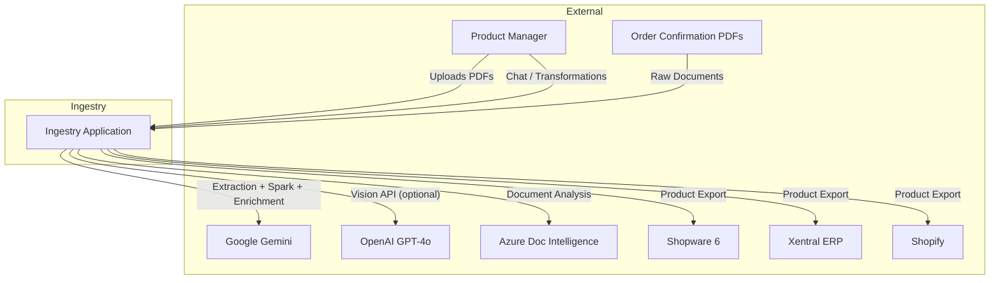
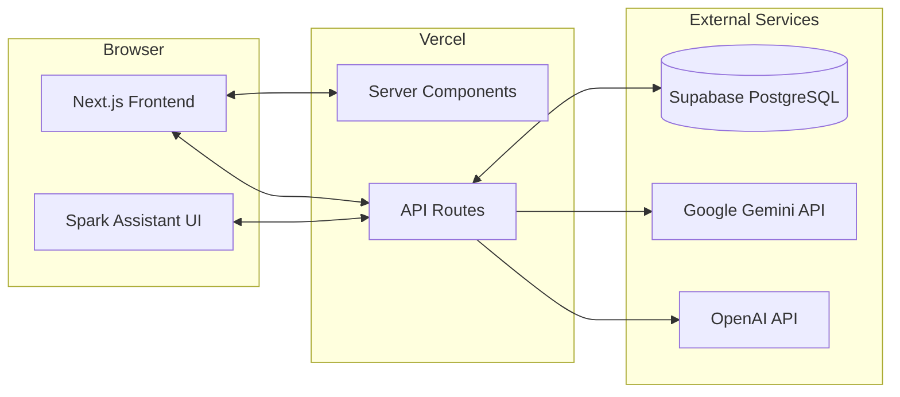
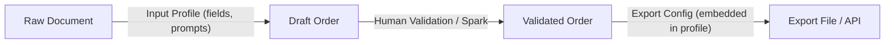
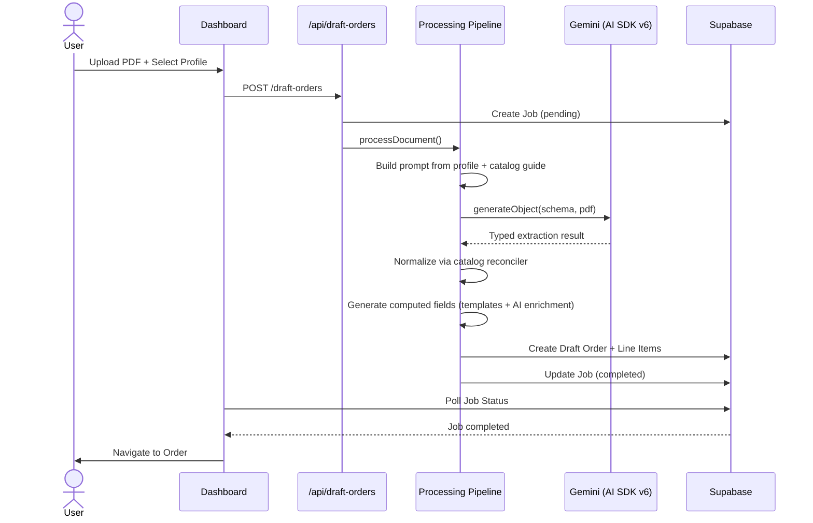
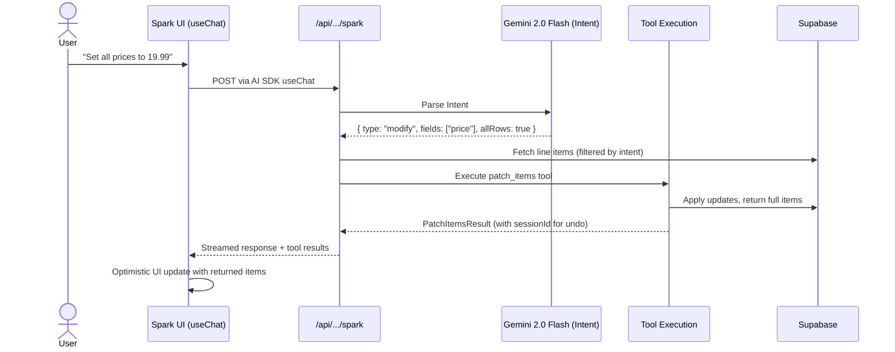
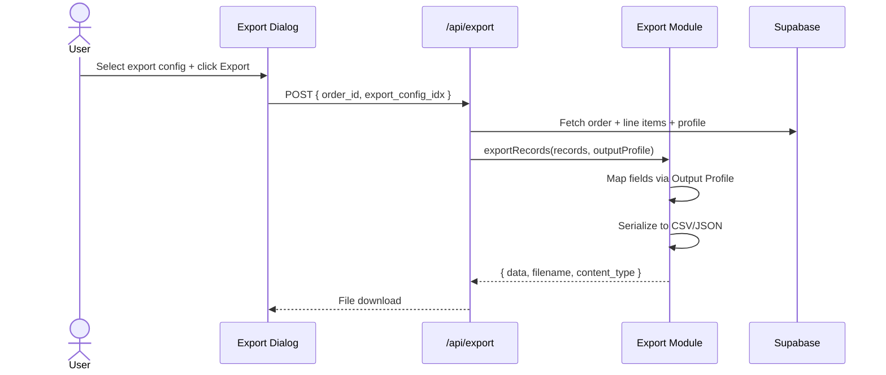
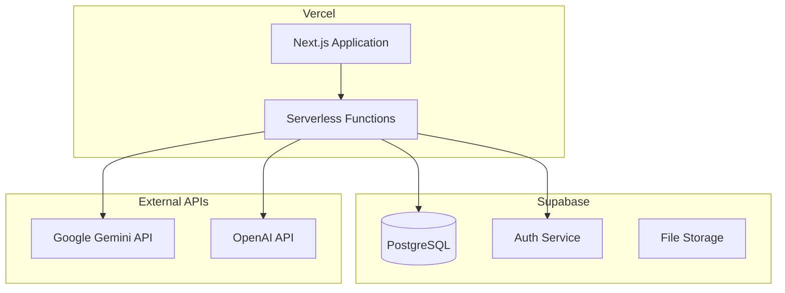

# Ingestry – Arc42 Architecture Documentation

> **Version:** 2.0  
> **Date:** February 8, 2026  
> **Status:** Current

---

## 1. Introduction and Goals

### 1.1 Requirements Overview

**Ingestry** is an intelligent product data ingestion platform designed for fashion retail workflows. The core mission is to transform unstructured product data from order confirmation PDFs into structured, validated data ready for export to various ERP and e-commerce systems.

**Essential Features:**

- **AI-Powered Extraction**: Uses Gemini 3 Flash (default) or GPT-4o Vision via AI SDK v6 with dynamic Zod schema generation from processing profiles.
- **Spark Assistant**: A conversational AI assistant (Gemini-powered) for natural language data transformation, queries, and analysis — with native tool calling and undo support.
- **Configurable Intake**: Dynamic Processing Profiles defining extraction schema, computed fields (templates + AI enrichment), and catalog matching rules.
- **Catalog-Based Normalization**: Exact, alias, fuzzy, and compound value matching against catalog entries. AI-assisted matching via Catalog Match Guide injection into extraction prompts.
- **Multi-Format Export**: Modular export with Output Profiles (CSV/JSON), field mapping, and template support — embedded directly in unified Processing Profiles.
- **Multi-Destination Export**: Adapters for Shopware 6, Xentral ERP, and Shopify.
- **Multi-Tenant Architecture**: Full data isolation via Supabase RLS.

### 1.2 Quality Goals

| Priority | Quality Goal       | Description                                                              |
| -------- | ------------------ | ------------------------------------------------------------------------ |
| 1        | **Accuracy**       | Extraction and Spark transformations must be reliable and verifiable     |
| 2        | **Responsiveness** | Spark Assistant must respond in near real-time (<2s for intent)          |
| 3        | **Flexibility**    | Fully configurable profiles—no hardcoded business logic                  |
| 4        | **Usability**      | Human-in-the-loop validation with efficient bulk editing & AI assistance |
| 5        | **Scalability**    | Multi-tenant isolation, background job processing                        |

### 1.3 Stakeholders

| Role                 | Expectations                                              |
| -------------------- | --------------------------------------------------------- |
| **Product Managers** | Fast, accurate data ingestion; minimal manual corrections |
| **Operations Teams** | Reliable exports; clear job status visibility             |
| **Developers**       | Clean architecture; easy adapter development              |
| **Tenant Admins**    | Self-service profile configuration; catalog management    |

---

## 2. Architecture Constraints

### 2.1 Technical Constraints

| Constraint            | Description                                                                               |
| --------------------- | ----------------------------------------------------------------------------------------- |
| **Next.js 16**        | Application built on App Router with React Server Components                              |
| **TypeScript**        | Strict typing throughout the codebase                                                     |
| **Supabase**          | PostgreSQL database with Row-Level Security (RLS)                                         |
| **Vercel AI SDK v6**  | Unified AI interface using `generateObject` with Zod schemas                              |
| **Google Gemini**     | Primary AI provider: Gemini 3 Flash (extraction/Spark), Gemini 2.0 Flash (intent parsing) |
| **OpenAI API**        | Optional GPT-4o Vision for document extraction                                            |
| **Vercel Deployment** | Serverless functions with timeout constraints                                             |

### 2.2 Organizational Constraints

| Constraint                    | Description                                                               |
| ----------------------------- | ------------------------------------------------------------------------- |
| **Pure Templating**           | All field transformations must be explicitly configured—no magic defaults |
| **Profile-Driven Processing** | All extraction and normalization requires a selected profile              |
| **Human-in-the-Loop**         | Draft orders require manual validation before export                      |

### 2.3 Conventions

| Convention           | Description                                                 |
| -------------------- | ----------------------------------------------------------- |
| **Field Keys**       | Lowercase with underscores (e.g., `style_code`)             |
| **Catalogs**         | Canonical names stored, codes accessed via `.code` modifier |
| **Tenant Isolation** | All data tables use `tenant_id` with RLS policies           |

#### UI/UX Conventions

**Spatial Philosophy (Layered Design System)**

| Level | Name    | Usage             | Styling                                                                    |
| ----- | ------- | ----------------- | -------------------------------------------------------------------------- |
| 0     | Canvas  | Global background | `bg-gradient-to-br from-background to-muted/40`                            |
| 1     | Surface | Page containers   | `bg-card/60 backdrop-blur-md ring-1 ring-inset ring-border/50 rounded-2xl` |
| 2     | Overlay | Dialogs, popovers | `bg-card/95 backdrop-blur-sm shadow-xl ring-1 ring-border/50 rounded-xl`   |

> **Never stack Level 1 surfaces.** Nested cards use `bg-muted/30` or `bg-muted/50`.

**Core Styling Rules**

| Convention              | Description                                                                      |
| ----------------------- | -------------------------------------------------------------------------------- |
| **Soft Ring Mandatory** | `border` must always be paired with `ring-1 ring-inset ring-border/50`           |
| **Rounded Corners**     | Cards: `rounded-2xl`; inputs/buttons: `rounded-lg`                               |
| **Glassmorphic Forms**  | `bg-muted/40 border-border/40 focus:bg-background focus-visible:ring-primary/40` |
| **Tactile Feedback**    | All clickables: `active:scale-[0.98]`                                            |
| **Hover States**        | Interactive surfaces: `hover:bg-muted/60`                                        |

**Lineage Color System**

| Type        | Usage                   | Backgrounds                            | Badges                               |
| ----------- | ----------------------- | -------------------------------------- | ------------------------------------ |
| Source (S)  | Extracted from document | `bg-blue-50/30` / `bg-blue-950/20`     | `bg-blue-100` / `bg-blue-900/80`     |
| Virtual (V) | Computed/AI-enriched    | `bg-purple-50/30` / `bg-purple-950/20` | `bg-purple-100` / `bg-purple-900/80` |

---

## 3. System Scope and Context

### 3.1 Business Context



### 3.2 Technical Context



---

## 4. Solution Strategy

### 4.1 Unified Profile Architecture

Ingestry uses **Unified Profiles** that consolidate intake and egress configuration into a single record:



**Input Profile** defines:

- Field schema for AI extraction (key, label, type, required, catalog_key)
- Computed fields (template-based or AI enrichment)
- SKU template and generation flag
- Custom prompt additions
- One or more embedded **Export Configs** (previously separate Output Profiles)

**Export Config** (embedded) defines:

- Target shop system
- Field mappings (source → target with optional templates)
- Serialization format (CSV/JSON) with format options

### 4.2 Spark Architecture (Agentic AI with Tool Calling)

The "Spark" assistant uses a specialized architecture combining two-phase processing with native tool calling:

1.  **Phase 1: Intent Parsing (Gemini 2.0 Flash)**
    - **Goal**: Extremely fast (<1s) determination of user intent.
    - **Output**: Classifies request type (modification, question, recalculation, confirmation). Identifies target fields and filtering conditions.
    - **Why**: Avoids sending massive context windows for simple queries.

2.  **Phase 2: Execution via Tool Calling (Gemini 3 Flash / 2.5 Flash)**
    - **Tools available**:
      - `patch_items` — Update specific fields on specific items (Schema Master: validates against profile field types)
      - `recalculate_fields` — Regenerate computed/template fields after source value changes
      - `query_order_data` — Read-only data analysis (counts, unique values, filtering)
      - `suggest_catalog_alias` — Suggest adding new catalog aliases (requires user confirmation)
    - **Output**: Tool results include full updated item data for optimistic UI updates.

### 4.3 Technology Decisions

| Decision               | Rationale                                                                            |
| ---------------------- | ------------------------------------------------------------------------------------ |
| **Next.js App Router** | Unified frontend/backend, server components for performance                          |
| **Supabase + RLS**     | Managed PostgreSQL with built-in multi-tenancy via Row-Level Security                |
| **Vercel AI SDK v6**   | Unified AI interface: `generateObject` with Zod schemas for type-safe extraction     |
| **Google Gemini**      | Primary AI provider — superior speed/cost for extraction, chat, and enrichment       |
| **GPT-4o (optional)**  | Alternative Vision model for document extraction via legacy mode                     |
| **Zod 4**              | Runtime schema validation, dynamic schema generation from profile fields             |
| **shadcn/ui**          | Accessible, customizable component library                                           |
| **Tailwind CSS 4**     | Utility-first styling with design system tokens                                      |
| **Custom DLS**         | Extending shadcn/ui with "Modern App" aesthetics (rings, gradients, semantic colors) |
| **Framer Motion**      | Smooth animations and micro-interactions                                             |

---

## 5. Building Block View

### 5.1 Level 1: System Overview

```
ingestry/
├── src/
│   ├── app/                    # Next.js App Router
│   │   ├── api/                # REST API endpoints
│   │   ├── dashboard/          # Main application UI
│   │   └── login/              # Authentication
│   ├── components/             # React components
│   │   ├── layout/             # Page containers & headers
│   │   ├── orders/flow/        # DraftOrderGrid, Spark UI
│   │   ├── settings/           # Profile editor tabs
│   │   └── ui/                 # shadcn/ui + custom components
│   ├── hooks/                  # React hooks
│   ├── lib/                    # Core business logic
│   │   ├── adapters/           # Shop system integrations
│   │   ├── export/             # Output Profile evaluation & serialization
│   │   ├── extraction/         # AI clients, Spark engine, prompt building
│   │   ├── import/             # CSV parsing
│   │   ├── modules/processing/ # Pipeline & normalizer
│   │   ├── services/           # Template engine, catalog reconciler, AI enrichment
│   │   └── supabase/           # Database clients
│   └── types/                  # TypeScript definitions
├── supabase/
│   └── migrations/             # Database schema (23 migrations)
└── public/                     # Static assets
```

### 5.2 Level 2: Core Modules

#### API Layer (`src/app/api/`)

| Module          | Responsibility                                                  |
| --------------- | --------------------------------------------------------------- |
| `catalogs/`     | Catalog entry management, alias creation, normalization testing |
| `draft-orders/` | Order CRUD, line item management, Spark chat, export triggers   |
| `export/`       | File export generation using embedded Output Profiles           |
| `jobs/`         | Background job status and monitoring                            |
| `settings/`     | Input Profile management, vision model configuration            |
| `tenant/`       | Tenant member listing, data reset                               |

#### Extraction Layer (`src/lib/extraction/`)

| Module                 | Responsibility                                             |
| ---------------------- | ---------------------------------------------------------- |
| `index.ts`             | Unified extraction interface (AI SDK or legacy mode)       |
| `ai-sdk-extraction.ts` | AI SDK v6 with dynamic Zod schema from profile fields      |
| `spark-client.ts`      | Two-phase Spark engine (intent parsing → patch generation) |
| `spark-tools.ts`       | Native tool schemas using Schema Master pattern            |
| `prompt-builder.ts`    | Dynamic prompt generation from processing profiles         |
| `profile-guesser.ts`   | AI-powered schema suggestion from sample documents         |
| `unified-ai-client.ts` | Central AI model instances (Spark, Extraction, Intent)     |
| `openai-client.ts`     | Legacy OpenAI Vision client                                |
| `gemini-client.ts`     | Legacy Gemini Vision client                                |

#### Business Logic (`src/lib/services/` + `src/lib/modules/`)

| Module                          | Responsibility                                                    |
| ------------------------------- | ----------------------------------------------------------------- |
| `modules/processing/`           | Processing pipeline orchestration, normalizer                     |
| `services/template-engine`      | SKU template parsing, code resolution, evaluation                 |
| `services/catalog-reconciler`   | Catalog matching (exact, alias, fuzzy, compound), cache, AI guide |
| `services/ai-enrichment`        | AI-generated computed field values via Gemini                     |
| `services/regenerate-templates` | Template & AI enrichment regeneration for line items              |
| `services/draft-order.service`  | Draft order CRUD, shop submission                                 |
| `services/tenant.service`       | Multi-tenant context management                                   |

#### Export & Adapters

| Module          | Responsibility                                              |
| --------------- | ----------------------------------------------------------- |
| `lib/export/`   | Output Profile evaluation, field mapping, CSV serialization |
| `lib/adapters/` | Shop system integrations (Shopware 6, Xentral, Shopify)     |
| `lib/import/`   | CSV parser with automatic delimiter detection               |

#### UI Components (`src/components/`)

| Module         | Responsibility                                                           |
| -------------- | ------------------------------------------------------------------------ |
| `layout/`      | PageHeader, SubPageHeader, PageContainer                                 |
| `orders/flow/` | DraftOrderGrid, IngestrySpark (Chat UI), FloatingActionBar, EditableCell |
| `orders/`      | ExportDialog                                                             |
| `settings/`    | IntakeTab, TransformTab, ExportTab, ProfilePreviewTable                  |
| `ui/`          | shadcn/ui base + LineageBadge, SourceTooltip, TemplateInput              |

---

## 6. Runtime View

### 6.1 PDF Processing Flow



### 6.2 Spark Interaction Flow



### 6.3 Export Flow



---

## 7. Deployment View

### 7.1 Infrastructure



### 7.2 Environment Configuration

| Variable                               | Purpose                              |
| -------------------------------------- | ------------------------------------ |
| `NEXT_PUBLIC_SUPABASE_URL`             | Supabase project URL                 |
| `NEXT_PUBLIC_SUPABASE_PUBLISHABLE_KEY` | Supabase publishable (anon) key      |
| `SUPABASE_SECRET_KEY`                  | Server-side admin operations         |
| `GEMINI_API_KEY`                       | Google Gemini access (primary AI)    |
| `OPENAI_API_KEY`                       | GPT-4o Vision access (optional)      |
| `MOCK_EXTERNAL_APIS`                   | Enable mock adapters for development |

---

## 8. Cross-cutting Concepts

### 8.1 Multi-Tenancy

All data is isolated per tenant using Supabase Row-Level Security:

```sql
CREATE POLICY "Tenant isolation" ON table_name
    FOR ALL USING (tenant_id = get_user_tenant_id());
```

### 8.2 Schema Master Pattern

Spark tools and extraction schemas are dynamically generated from the active Processing Profile's field definitions. This ensures:

- Tool parameters validate against actual profile field types
- Extraction schemas match the expected output structure
- No hardcoded field assumptions exist in the AI layer

### 8.3 Unified Profiles

Input Profiles and Output Profiles have been consolidated into a single `input_profiles` table (migration `021_unified_profiles.sql`). Each profile contains:

- Intake field definitions
- SKU template configuration
- One or more embedded Export Configs (previously stored in a separate `output_profiles` table)

A backwards-compatible `processing_profiles` view exists over `input_profiles` for transition purposes.

### 8.4 Catalog System

The normalization system was renamed from "Code Lookups" to "Catalogs" (migration `023_rename_lookups_to_catalogs.sql`):

- `code_lookups` → `catalog_entries`
- `lookup_column_defs` → `catalog_fields`

Catalogs support custom columns per type via `extra_data` JSONB and the `catalog_fields` table.

### 8.5 Spark Undo & Sessions

To support "Undo" functionality, Spark tool results include a `sessionId`. Each `patch_items` call stores `previous_data` per line item, enabling immediate revert of the last AI action without complex database versioning.

---

## 9. Architecture Decisions

### ADR-1: Profile-Required Processing

**Decision:** All PDF processing requires an explicit Input Profile selection.  
**Consequences:** Consistent data, no magic defaults.

### ADR-2: Unified Profile Architecture

**Decision:** Consolidate Input Profiles and Output Profiles into a single record with embedded Export Configs.  
**Consequences:** Simplified management, single source of truth per workflow. Output Profiles table dropped.

### ADR-3: Supabase with Row-Level Security

**Decision:** Use Supabase PostgreSQL with RLS.  
**Consequences:** Built-in security; explicit `tenant_id` handling.

### ADR-4: Gemini-First AI Strategy

**Context:** The application requires AI for extraction, Spark chat, intent parsing, and AI enrichment.  
**Decision:** Use **Google Gemini** as the primary AI provider for all capabilities. Gemini 3 Flash for extraction and Spark, Gemini 2.0 Flash for fast intent parsing. GPT-4o available as optional alternative for extraction only.  
**Consequences:** Single API key simplifies deployment. Superior speed/cost ratio. AI SDK v6 abstracts provider differences.

### ADR-5: AI SDK v6 with Typed Schemas

**Context:** Extraction needs to be type-safe and profile-driven.  
**Decision:** Use Vercel AI SDK v6 `generateObject` with dynamic Zod schemas built from profile fields.  
**Consequences:** Type-safe extraction results, automatic validation, unified interface across providers.

### ADR-6: Schema Master for Spark Tools

**Decision:** Spark tool schemas are dynamically generated from the active profile's field definitions.  
**Consequences:** Tools validate against real field types, no hardcoded field assumptions, tools adapt to any profile.

---

## 10. Quality Requirements

### 10.1 Quality Scenarios

| Quality            | Scenario                 | Measure                         |
| ------------------ | ------------------------ | ------------------------------- |
| **Performance**    | Process 50-item PDF      | < 30 seconds                    |
| **Responsiveness** | Spark Intent Recognition | < 1 second                      |
| **Accuracy**       | Field extraction success | > 95% without manual correction |
| **Availability**   | Dashboard uptime         | 99.5%                           |

---

## 11. Risks and Technical Debt

| Risk/Debt                  | Description                                                      | Mitigation                                                 |
| -------------------------- | ---------------------------------------------------------------- | ---------------------------------------------------------- |
| **AI Provider Dependency** | Heavy reliance on Google Gemini across all features              | AI SDK abstracts providers; GPT-4o fallback for extraction |
| **Spark Session State**    | Undo relies on in-memory previous data per patch                 | Move to DB-backed audit log in future                      |
| **Schema Evolution**       | Profile field changes affect existing data                       | Migration scripts; template regeneration                   |
| **Legacy Code Paths**      | Deprecated `@google/genai` client still present alongside AI SDK | Consolidate to AI SDK-only in future                       |
| **Mock-Only Shopify**      | Shopify adapter runs in mock mode only                           | Implement real API integration when needed                 |

---

## 12. Glossary

| Term                    | Definition                                                                       |
| ----------------------- | -------------------------------------------------------------------------------- |
| **Spark**               | The conversational AI assistant for data transformation and analysis.            |
| **Intent Parser**       | Spark Phase 1: Identifies what the user wants to do (Gemini 2.0 Flash).          |
| **Tool Calling**        | Spark Phase 2: Executes actions via native LLM tool schemas.                     |
| **Schema Master**       | Pattern where tool/extraction schemas are dynamically built from profile fields. |
| **Draft Order**         | A processing run containing extracted line items awaiting validation.            |
| **Input Profile**       | Unified configuration: intake fields + export configs + SKU template.            |
| **Export Config**       | Embedded configuration defining field mapping and export format.                 |
| **Catalog Entry**       | A normalization value with name, code, aliases, and optional custom data.        |
| **Catalog Match Guide** | AI prompt injection that lists valid catalog names for semantic matching.        |
| **Tenant**              | Isolated organization account with its own data and configurations.              |
| **Line Item**           | A single product row in a draft order with raw and normalized data.              |
| **Computed Field**      | A virtual field whose value is generated from a template or AI enrichment.       |

---

_Generated with arc42 template. For more information: [arc42.org](https://arc42.org)_
